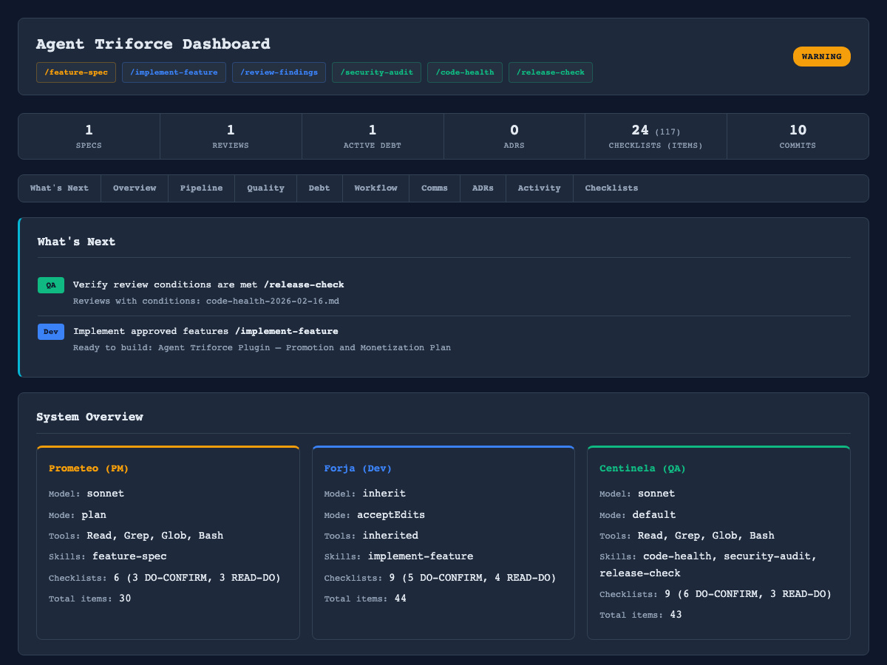

# Agent Triforce

[](https://github.com/ArtemioPadilla/agent-triforce/stargazers)
[](LICENSE)
[](CHANGELOG.md)
[](https://claude.ai/code)
[](https://github.com/sponsors/ArtemioPadilla)

A 3-agent development system (PM / Dev / QA) that applies checklist methodology from *The Checklist Manifesto* (Atul Gawande) and Boeing's checklist engineering (Daniel Boorman) to AI-assisted software development. Built for teams and individuals who want structured, auditable, production-grade workflows — not ad-hoc prompting.



## Why Agent Triforce?

Most multi-agent systems focus on *more agents*. Agent Triforce focuses on *more discipline*.

- **Methodology over quantity** — 3 agents with 24 checklists (117 items) governed by the WHO Surgical Safety Checklist model, not 100+ generic agents with no coordination
- **Three mandatory pause points** — every agent invocation follows SIGN IN (before work), TIME OUT (mid-workflow verification), SIGN OUT (before handoff). Steps don't get skipped.
- **Engineering principles built in** — Clean Architecture, TDD, FIRST testing, and refactoring methodology are embedded into agent behavior, not left to chance
- **Persistent memory** — agents build on prior decisions across sessions. Context carries forward, not lost between invocations
- **Structured handoffs** — 6 defined communication paths between agents with explicit protocols (what was done, what to watch for, what's needed next)

## Install

### As a Plugin (add to any existing project)

```bash
/plugin marketplace add ArtemioPadilla/agent-triforce
/plugin install agent-triforce@agent-triforce
/agent-triforce:setup    # scaffold project directories
```

For a step-by-step walkthrough, see the [Quickstart Guide](docs/quickstart.md).

### As a Template (start a new project)

```bash
gh repo create my-project --template ArtemioPadilla/agent-triforce
cd my-project
claude
```

## Agents

| Agent | Name | Role | Model | Mode |
|-------|------|------|-------|------|
| PM | **Prometeo** | Product specs, business logic, prioritization | Sonnet | Plan (read-only) |
| Dev | **Forja** | Architecture, implementation, testing, docs | Inherit | Accept Edits |
| QA | **Centinela** | Security, code review, compliance, dead code | Sonnet | Default |

## Skills

| Skill | Agent | What it does |
|-------|-------|-------------|
| `/feature-spec` | Prometeo | Create a feature specification (tiered: S/M/L) |
| `/implement-feature` | Forja | Implement a feature from its spec (TDD workflow) |
| `/generate-tests` | Forja | Generate tests following FIRST + Arrange-Act-Assert |
| `/review-findings` | Forja | Fix findings from a QA review |
| `/reindex` | Forja | Rebuild codebase knowledge index |
| `/security-audit` | Centinela | Deep OWASP security audit |
| `/code-health` | Centinela | Dead code, tech debt, dependency scan |
| `/release-check` | Centinela | Pre-release verification gate with GO/NO-GO |
| `/traceability` | Centinela | Spec-to-implementation traceability matrix |
| `/checklist-health` | Centinela | Checklist evolution tracking and health report |
| `/simulate-failure` | Centinela | Non-Normal procedure training (fire drills) |

When installed as a plugin, skills are namespaced: `/agent-triforce:feature-spec`, etc.

## Workflow

```
/feature-spec → /implement-feature → /security-audit → /review-findings → repeat
```

```
PM  SIGN IN → spec → TIME OUT → SIGN OUT
  → Dev SIGN IN → implement → TIME OUT → TIME OUT → SIGN OUT
    → QA  SIGN IN → audit → TIME OUT → SIGN OUT
      → Dev SIGN IN → fix → SIGN OUT
        → QA  SIGN IN → verify → SIGN OUT
```

## Methodology

This system applies principles from *The Checklist Manifesto* (Atul Gawande) and Boeing's checklist engineering (Daniel Boorman), structured around the WHO Surgical Safety Checklist.

**Core ideas:**
- **Checklists supplement expertise** — reminders of the most critical steps, not how-to guides
- **FLY THE AIRPLANE** — step 1 of any emergency is to remember your primary mission
- **Three pause points** per agent invocation: **SIGN IN** (before work), **TIME OUT** (mid-workflow verification), **SIGN OUT** (before handoff)
- **Two types**: DO-CONFIRM (verify after work) and READ-DO (step-by-step for handoffs and error recovery)
- **24 checklists, 117 items** across 3 agents. No checklist exceeds 9 items.

## Engineering Principles

Every agent follows established software engineering practices:

- **Specs**: IEEE 830 + INVEST validation, tiered templates (S/M/L), GIVEN/WHEN/THEN acceptance criteria
- **Architecture**: Clean Architecture (Robert C. Martin) — dependency rule, screaming architecture, SOLID
- **Development**: TDD Red-Green-Refactor (Kent Beck), Clean Code (<30 line functions, meaningful names, DRY)
- **Testing**: FIRST principles (Fast, Isolated, Repeatable, Self-validating, Timely), Arrange-Act-Assert pattern
- **Refactoring**: Fowler's toolkit — Extract Method, Rename, Move, Boy Scout Rule
- **Infrastructure**: 12-Factor App patterns, Gang of Four design patterns

## Key Features

- **Persistent Memory**: Each agent remembers decisions across sessions, with cross-agent conflict detection
- **Auto-formatting**: Dev agent auto-runs ruff/biome after every file edit
- **Permission Enforcement**: PM can't edit code (plan mode), QA is read-only by default
- **Security Scanner**: Pre-commit hook detects hardcoded secrets, SQL injection, XSS patterns
- **System Dashboard**: HTML dashboard auto-generated after every agent session
- **Automated Handoffs**: Structured handoff artifacts generated at every agent boundary
- **Approval Gates**: Formal plan and release gates between agents with audit trail
- **Workflow Tracking**: `/status` command shows current phase, checklists, blockers
- **Session Analytics**: Per-agent token usage, cost estimates, and performance tracking
- **CI/CD Templates**: GitHub Actions workflows for PR review, security audit, release check
- **Codebase Index**: Shared module map with dependency graph, hotspots, and signatures
- **Smart Routing**: Per-skill model selection (Haiku/Sonnet/Opus) with cost estimates
- **Growth Tracking**: Pre-launch readiness gates, milestone-gated actions, weekly metrics log

## Project Structure

```
.
├── CLAUDE.md                          # System rules & conventions
├── CHANGELOG.md                       # Keep a Changelog format
├── TECH_DEBT.md                       # Technical debt register
├── .claude/
│   ├── agents/
│   │   ├── prometeo-pm.md             # PM agent
│   │   ├── forja-dev.md               # Dev agent
│   │   └── centinela-qa.md            # QA agent
│   └── skills/                        # 11 skill definitions
├── agent-triforce/                    # Plugin marketplace package
│   ├── agents/                        # Agent configurations
│   ├── skills/                        # Skill definitions
│   ├── commands/                      # 15 commands
│   ├── hooks/                         # security scanner, handoffs, dashboard
│   └── tools/                         # Tool scripts
├── tools/
│   ├── dashboard.py                   # HTML/terminal system dashboard
│   ├── security-scanner.py            # Pre-commit secret/vulnerability scanner
│   ├── handoff-generator.py           # Structured handoff artifact generator
│   ├── workflow-tracker.py            # Workflow state and progress tracker
│   ├── gate-checker.py                # Plan/release approval gates
│   ├── memory-sync.py                 # Cross-agent memory conflict detection
│   ├── traceability.py                # Spec-to-implementation traceability
│   ├── session-tracker.py             # Session analytics and cost tracking
│   ├── growth-tracker.py              # Growth phase tracking and readiness gates
│   └── codebase-indexer.py            # Codebase knowledge index builder
├── templates/
│   ├── lsp/                           # LSP configs (Python, TypeScript, Rust)
│   ├── mcp/                           # MCP configs (SonarQube, Linear, Jira)
│   ├── ci/                            # GitHub Actions workflow templates
│   ├── agent-routing.json             # Per-skill model routing
│   └── context-profiles.json          # Context loading profiles
├── docs/
│   ├── specs/                         # Feature specifications (PM)
│   ├── adr/                           # Architecture Decision Records (Dev)
│   ├── reviews/                       # Code reviews & audits (QA)
│   ├── handoffs/                      # Handoff artifacts between agents
│   ├── gates/                         # Approval gate documents
│   ├── traceability/                  # Spec-to-code matrices
│   └── training/                      # Simulation training reports
├── src/                               # Source code
└── tests/                             # Tests
```

## Customization

| What | Where |
|------|-------|
| Tech stack preferences | `CLAUDE.md` → Tech Stack Preferences |
| Agent behavior | `.claude/agents/{agent-name}.md` |
| Add new skills | `.claude/skills/{skill-name}/SKILL.md` |
| Project-specific rules | `CLAUDE.md` or `.claude/rules/` |

## Requirements

- [Claude Code](https://claude.ai/code) v2.1.32+
- Claude Max or Pro subscription (or API key)

> **Note**: Agent Triforce is a provider-agnostic methodology. The checklist framework, agent roles, and workflows are portable to other AI coding tools as they mature to support multi-agent orchestration.

## Support

If Agent Triforce helps your team ship better software, consider [sponsoring development](https://github.com/sponsors/ArtemioPadilla).

## License

[MIT](LICENSE)
